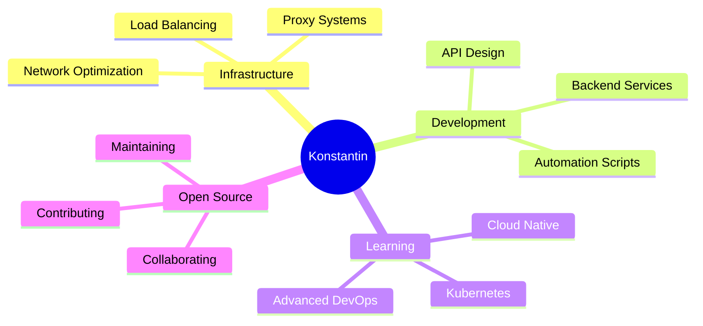

<div align="center">
  
</div>

<div align="center">
  
  ### 🚀 Full-Stack Developer | Infrastructure Engineer | Open Source Enthusiast
  
  
  
</div>

---

## 👨‍💻 About Me

```typescript
const konstantin = {
    location: "Helsinki, Finland 🇫🇮",
    currentFocus: ["Infrastructure Architecture", "Network Engineering", "DevOps"],
    technologies: {
        backend: ["Node.js", "Python", "Go"],
        frontend: ["JavaScript", "HTML/CSS", "React"],
        infrastructure: ["Docker", "Nginx", "MySQL", "Xray"],
        cloud: ["AWS", "Azure", "Self-hosted solutions"],
        tools: ["Git", "Linux", "Automation"]
    },
    architecture: ["Microservices", "Load Balancing", "Proxy Systems"],
    currentlyLearning: "Advanced Kubernetes & Cloud Native Technologies",
    funFact: "I optimize networks faster than I optimize my coffee intake ☕"
};
```

---

## 🛠️ Tech Stack

<div align="center">

### Languages & Frameworks


### Infrastructure & DevOps


</div>

---

## 📊 GitHub Statistics

<div align="center">
  
  
</div>

<div align="center">
  
</div>

<div align="center">
  
</div>

---

## 🏆 GitHub Achievements

<div align="center">
  
</div>

---

## 🚧 Featured Projects

<div align="center">

<a href="https://github.com/konstpic/3x-ui-MySQL-fork">
  
</a>

<a href="https://github.com/konstpic/nginx-balancer">
  
</a>

</div>

---

## 📈 Contribution Graph

<div align="center">
  
</div>

---

## 🎯 Current Focus



---

## 💡 Random Dev Quote

<div align="center">
  
</div>

---

## 📫 Connect With Me

<div align="center">
  
[](https://github.com/konstpic)
[](#)
[](#)
[](mailto:your.email@example.com)

</div>

---

## 🐍 Contribution Snake

<div align="center">
  
</div>

---

<div align="center">
  
  ### 💭 "Code is like humor. When you have to explain it, it's bad." – Cory House
  
  
  
  
  
</div>