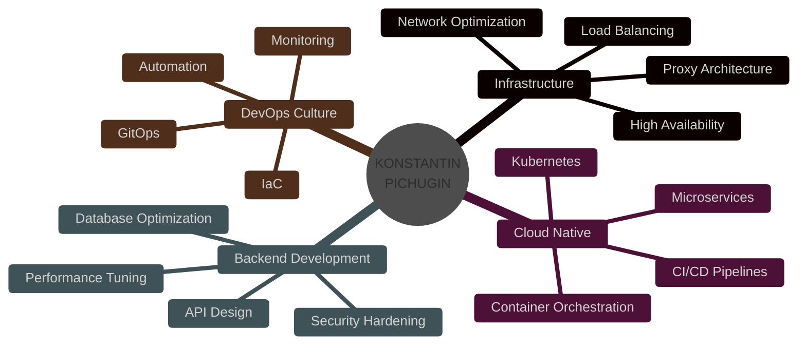

<div align="center">

<!-- Liquid Glass Hero Section -->


</div>

<br/>

<!-- Live Preview Section -->
<div align="center">

## 🚀 LIVE PREVIEW

<p align="center">
  <a href="https://konstpic.github.io/expertise-matrix/" target="_blank">
    
  </a>
</p>

<p align="center">
  <a href="https://konstpic.github.io/expertise-matrix/" target="_blank">
    
  </a>
</p>

<p align="center">
  <sub>✨ Click the image above to explore the interactive expertise matrix ✨</sub>
</p>

</div>

<br/>

<!-- Animated Status Banner -->
<div align="center">
  
```diff
@@                    🌊 DIVING DEEP INTO THE CODE OCEAN                    @@
+  Status: Building the future, one commit at a time
!  Location: Tula, Russia 🇷🇺 | Remote: 🌍 Worldwide
#  Current Vibe: ⚡ High Performance | 🎯 Precision Engineering
```

</div>

<br/>

<!-- Glassmorphic Stats Section -->
<div align="center">

### ✨ REALITY DISTORTION FIELD ✨

<table>
<tr>
<td width="50%" align="center">


</td>
<td width="50%" align="center">


</td>
</tr>
</table>

</div>

<br/>

<!-- Flowing Divider -->


<br/>

<!-- 💎 EXPERTISE MATRIX - From index.html -->
<div align="center">

## 💎 EXPERTISE MATRIX

<p align="center">
  <a href="https://konstpic.github.io/expertise-matrix/" target="_blank">
    
  </a>
</p>

<p align="center">
  <sub>Interactive terminal-style portfolio showcasing technology expertise</sub>
</p>

### 🎯 Technology Categories

<table>
<tr>
<td width="25%" align="center">

#### 🔴 Infrastructure
<div align="center">


</div>

</td>
<td width="25%" align="center">

#### 🟣 Cloud & DevOps
<div align="center">


</div>

</td>
<td width="25%" align="center">

#### 🟢 Backend
<div align="center">


</div>

</td>
<td width="25%" align="center">

#### 🟡 Frontend
<div align="center">


</div>

</td>
</tr>
</table>

</div>

<br/>


<br/>

<!-- Tech Arsenal with Liquid Effect -->
<div align="center">

## 🔮 TECHNOLOGY ARSENAL

<details open>
<summary><b>⚡ CORE STACK</b></summary>
<br/>

<div align="center">

**Backend Engineering**


**Infrastructure & DevOps**


**Frontend Craft**


</div>

</details>

</div>

<br/>

<!-- Liquid Metrics -->
<div align="center">

## 📊 PERFORMANCE METRICS


</div>

<br/>

<!-- Language Distribution -->
<div align="center">


</div>

<br/>


<br/>

<!-- Featured Projects Showcase -->
<div align="center">

## 🎯 SIGNATURE PROJECTS

<table>
<tr>
<td width="50%">

### 🔥 3x-ui MySQL Fork
> Advanced proxy management system with MySQL backend integration

[](https://github.com/konstpic/3x-ui-MySQL-fork)

**Tech:** `Node.js` `MySQL` `Docker` `Nginx`

</td>
<td width="50%">

### ⚖️ Nginx Balancer
> High-performance load balancing solution for distributed systems

[](https://github.com/konstpic/nginx-balancer)

**Tech:** `Nginx` `Linux` `DevOps` `Networking`

</td>
</tr>
</table>

</div>

<br/>


<br/>

<!-- Mindmap Section -->
<div align="center">

## 🧠 CURRENT FOCUS AREAS



</div>

<br/>


<br/>

<!-- Achievements Section -->
<div align="center">

## 🏆 ACHIEVEMENTS UNLOCKED

<table>
<tr>
<td align="center" width="20%">

<br/>
<sub><b>Commits</b></sub>
<br/>
<sub>Building Daily</sub>
</td>
<td align="center" width="20%">

<br/>
<sub><b>Containerization</b></sub>
<br/>
<sub>Master</sub>
</td>
<td align="center" width="20%">

<br/>
<sub><b>Linux Guru</b></sub>
<br/>
<sub>Expert Level</sub>
</td>
<td align="center" width="20%">

<br/>
<sub><b>Load Balancing</b></sub>
<br/>
<sub>Optimized</sub>
</td>
<td align="center" width="20%">

<br/>
<sub><b>Backend Dev</b></sub>
<br/>
<sub>Production Ready</sub>
</td>
</tr>
</table>

<br/>


</div>

<br/>

<!-- Contribution Snake -->
<div align="center">

## 🐍 CONTRIBUTION FLOW

<picture>
  <source media="(prefers-color-scheme: dark)" srcset="https://raw.githubusercontent.com/konstpic/konstpic/output/github-contribution-grid-snake-dark.svg">
  <source media="(prefers-color-scheme: light)" srcset="https://raw.githubusercontent.com/konstpic/konstpic/output/github-contribution-grid-snake.svg">
  
</picture>

</div>

<br/>


<br/>

<!-- Philosophy Section -->
<div align="center">

## 💭 ENGINEERING PHILOSOPHY

<table>
<tr>
<td align="center" width="33%">

### 🎯 PRECISION
*Every line of code<br/>serves a purpose*

</td>
<td align="center" width="33%">

### ⚡ PERFORMANCE
*Optimize for speed<br/>and efficiency*

</td>
<td align="center" width="33%">

### 🔒 SECURITY
*Build systems<br/>that last*

</td>
</tr>
</table>

> *"The best code is no code. The second best code is simple, elegant, and maintainable."*

</div>

<br/>

<!-- Typing Animation -->
<div align="center">


</div>

<br/>


<br/>

<!-- Contact Section -->
<div align="center">

## 📡 TRANSMISSION CHANNELS

<table>
<tr>
<td align="center">

[](https://github.com/konstpic)

</td>
<td align="center">

[](https://t.me/konstpic)

</td>
</tr>
</table>

### 🤝 Open for Collaboration

`Interesting Projects` • `Infrastructure Challenges` • `Open Source Contributions`

</div>

<br/>

<!-- Stats Footer -->
<div align="center">


</div>

<br/>

<!-- Liquid Footer Wave -->
<div align="center">
  
</div>

---

<div align="center">

### ⚡ *"In code we trust, in automation we thrive"* ⚡

**Made with 💙 and ☕ by Konstantin Pichugin**

</div>
